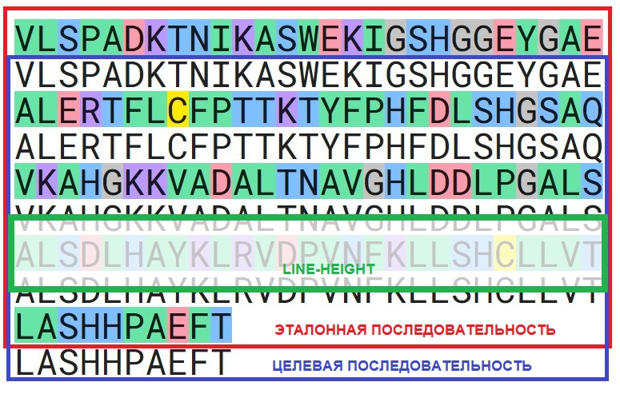

# Инструмент для визуализации выравнивания аминокислотных последовательностей

## Демонстрация

[GitHub Pages](https://andreireznikov.github.io/amino)

## О проекте

Инструмент предназначен для визуализации выравнивания двух аминокислотных последовательностей.

Пользователю доступны поля для ввода последовательностей, которые условно обозначены, как _эталонная_ и _целевая_. После ввода последовательностей и нажатия на кнопку _Выравнивание_ визуализация позволяет выявить их сходства и различия.

Для удобства добавлена кнопка с информацией об условных обозначениях и конфигурационная панель c селектором масштаба, переключателем фона, кнопкой Очистить.

Также уделено внимание доступности (a11y) инструмента.

## Требования к проекту

- Перенос с сохранением позиционирования текста последовательностей
- Окрашивание фона каждого символа без добавления большого количества элементов в DOM
- Корректная работа поиска по части последовательности
- Возможность копирования последовательности при выделении текста

## Реализация

### Позиционирование последовательностей

Элемент эталонной последовательности имеет свойство _position: relative_. Все остальные элементы последовательностей имеют _position: absolute_ (при желании можно добавить больше двух последовательностей). Элементы накладываются друг на друга.

Для посимвольного переноса текста добавлены свойства _word-break: break-all_ и _overflow-wrap: break-word_.

Для каждого элемента последовательности задан _line-height (больше font-size в 2 раза)_. Это позволяет визуально расположить текст последовательностей друг под другом с сохранением позиционирования.

Позиция последовательности рассчитывается динамически в зависимости от выбранного масштаба и количества последовательностей.

