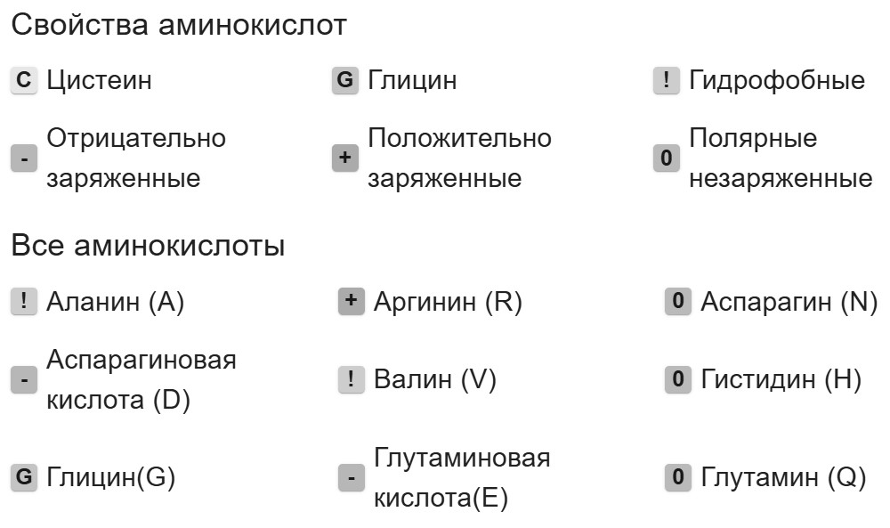

# Инструмент для визуализации выравнивания аминокислотных последовательностей

- [Демонстрация](#демонстрация)
- [О проекте](#о-проекте)
- [Требования к проекту](#требования-к-проекту)
- [Реализация](#реализация)
  - [Позиционирование последовательностей](#позиционирование-последовательностей)
  - [Окрашивание фона](#окрашивание-фона)
  - [Оптимизация](#оптимизация)
  - [Доступность (accessibility)](#доступность-accessibility)
  - [Проблемы подхода](#проблемы-подхода)
- [Технологии](#технологии)
  - [Стек](#стек)
  - [Запуск проекта](#запуск-проекта)

## Демонстрация

[GitHub Pages](https://andreireznikov.github.io/amino)

## О проекте

Инструмент предназначен для визуализации выравнивания двух аминокислотных последовательностей.

Пользователю доступны поля для ввода последовательностей, которые условно обозначены, как _эталонная_ и _целевая_. После ввода последовательностей и нажатия на кнопку _Выравнивание_ визуализация позволяет выявить их сходства и различия.

Для удобства добавлена кнопка с информацией об условных обозначениях и конфигурационная панель c селектором масштаба, переключателем фона, кнопкой Очистить.

Также уделено внимание _доступности (a11y)_ инструмента.

## Требования к проекту

- Перенос с сохранением позиционирования текста последовательностей
- Окрашивание фона каждого символа без добавления большого количества элементов в DOM
- Корректная работа поиска по части последовательности
- Возможность копирования последовательности при выделении текста

## Реализация

### Позиционирование последовательностей

Элемент эталонной последовательности имеет свойство _position: relative_. Все остальные элементы последовательностей имеют _position: absolute_ (при желании можно добавить больше двух последовательностей). Элементы накладываются друг на друга.

Для посимвольного переноса текста добавлены свойства _word-break: break-all_ и _overflow-wrap: break-word_.

Для каждого элемента последовательности задан _line-height (больше font-size в 2 раза)_. Это позволяет визуально расположить текст последовательностей друг под другом с сохранением позиционирования.

Позиция последовательности рассчитывается динамически, в зависимости от выбранного масштаба и количества последовательностей.

Данный подход позволяет избежать создания большого количества DOM элементов, добиться корректной работы поиска по части последовательности и реализовать возможность копирования части последовательности при выделении текста мышью.


### Окрашивание фона

Для окрашивания каждого символа используется свойство _background: linear-gradient_, которое применяется к элементу последовательности. Градиент рассчитывается динамически, в зависимости от ширины экрана и выбранного масштаба.


Градиент для последовательности AGSKCD:

```
background: linear-gradient(90deg,
  #67E4A6 0px, #67E4A6 54.2px,
  #C4C4C4 54.2px, #C4C4C4 108.4px,
  #80BFFF 108.4px, #80BFFF 162.6px,
  #BB99FF 162.6px, #BB99FF 216.8px,
  #FFEA00 216.8px, #FFEA00 271px,
  #FC9CAC 271px, #FC9CAC 325.2px)
0px 45px / 325.2px 90px no-repeat;
```

### Оптимизация

Градиент рассчитывается только в следующих случаях:

- выравнивание последовательностей
- изменение ширины экрана
- изменение масштаба

Рассчитанные градиенты сохраняются в виде массива строк (с использованием useRef), а затем, при переключении фона, присваиваются элементам последовательностей как CSS-свойство.

Данный подход был проверен для последовательностей длиной более _100 000 символов_. При замедлении CPU (6x slowdown) переключение фона занимает не более _2-х секунд_.

### Доступность (accessibility)

Все интерактивные элементы поддерживают работу с клавиатурой. Для элементов с неочевидным назначением добавлено описание (aria-label).

Для пользователей, у которых есть проблемы с различением цветов, добавлены условные символы, позволяющие связать аминокислоту со свойством, которым она обладает:



Также добавлена таблица с текстовым описанием результата, которая отображается при нажатии на кнопку _Результат_:


### Проблемы подхода

1. При добавлении большого количества аминокислотных последовательностей значение _line-height_ становится очень большим. При этом высота фона, появляющегося при выделении текста, соответствует установленному line-height.

2. Наложение элементов создаёт проблемы при выделении текста нужной последовательности. Для решения этой проблемы реализована функция динамического изменения _z-index_: при наведении курсора на текст элемент соответствующей последовательности выводится на передний план.

## Технологии

### Стек

- React
- TypeScript
- MUI
- react-hook-form

Проект разрабатывался с использованием:

- node 22.14.0
- npm 10.9.2

### Запуск проекта

Для работы с проектом клонируйте репозиторий:

```
git clone https://github.com/AndreiReznikov/amino/tree/master
```

Откройте папку с проектом и установите зависимости:

```
npm i
```

Для запуска проекта используйте:

```
npm run start
```
